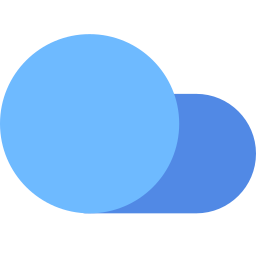

# Stowage [](https://www.nuget.org/packages/Stowage)




**Stowage** is a **bloat-free .NET cloud storage kit** that supports at minimum THE major ☁ providers.

- **Independent** 🆓. Provides an independent implementation of the ☁ storage APIs. Because you can't just have official corporate SDKs as a single source of truth.
- **Readable**. Official SDKs like the ones for [AWS](https://github.com/aws/aws-sdk-net), [Google](https://github.com/googleapis/google-cloud-dotnet), or [Azure](https://github.com/Azure/azure-storage-net) are overengineered and unreadable. Some are autogenerated and look just bad and foreign to .NET ecosystem. Some won't even compile without some custom rituals.
- **Beautiful** 🦋. Designed to fit into .NET ecosystem, not the other way around.
- **Rich** 💰. Provide maximum functionality. However, in addition to that, provide humanly possible way to easily extend it with new functionality, without waiting for new SDK releases.
- **Embeddable** 🔱. Has zero external dependencies, relies only on built-in .NET API. Often official SDKs have a very deep dependency tree causing a large binary sizes and endless conflicts during runtime. This one is a single .NET .dll with no dependencies whatsoever.
- **Cross Cloud** 🌥. Same API. Any cloud. Best decisions made for you. It's like iPhone vs Windows Phone.
- **Cross Tested** ❎. It's not just cross cloud but also cross tested (I don't know how to call this). It tests that all cloud providers behave absolutely the same on various method calls. They should validate arguments the same, throw same exceptions in the same situations, and support the same set of functionality. Sounds simple, but it's rare to find in a library. And it important, otherwise what's the point of a generic API if you need to write a lot of `if()`s? (or pattern matching).

> This library originally came out from being frustrated on working on my another library - [Storage.Net](https://github.com/aloneguid/storage). While it's OK, most of the time I had to deal with SDK incompatibilities, breaking changes, oddnesses, and slowness, whereas most of the time users needs something simple that just works.

## Getting Started

Right, time to gear up. We'll do it [step by step](https://www.oxfordlearnersdictionaries.com/definition/english/step_1?q=step). First, you need to [install](https://docs.microsoft.com/en-us/nuget/quickstart/install-and-use-a-package-using-the-dotnet-cli) the [](https://www.nuget.org/packages/Stowage) package.


Simplest case, using the local 💽 and writing text "I'm a page!!!" to a file called "pagefile.sys" at the root of disk C::

```csharp
using Stowage;

using(IFileStorage fs = Files.Of.LocalDisk("c:\\"))
{
   await fs.WriteText("pagefile.sys", "I'm a page!!!!");
}
```

This is local disk, yeah? But what about cloud storage, like Azure Blob Storage? Piece of cake:

```csharp
using Stowage;

using(IFileStorage fs = Files.Of.AzureBlobStorage("accountName", "accountKey", "containerName"))
{
   var entries = await fs.Ls();
}
```


## ♒ <span style="color:red">S</span>treaming

Streaming is a *first-class feature*. This means the streaming is real with no workarounds or in-memory buffers, so you can upload/download files of virtually unlimited sizes. Most official SDKs *do not support streaming* at all - surprisingly even the cloud leader's .NET SDK doesn't. Each requires some sort of crippled down version of stream - either knowing length beforehand, or will buffer it all in memory. I don't. I stream like a stream.

Proper streaming support also means that you can transform streams as you write to them or read from them - something that is not available in the native SDKs. For instance gzipping, encryption, anything else.

Streaming is also truly compatible with synchronous and asynchronous API.

## Details/Documentation

Whenever a method appears here, I assume it belongs to `IFileStorage` interface, unless specified.

### Listing/Browsing

Use `.Ls()` ([short for list](https://en.wikipedia.org/wiki/Ls)) - very easy to remember! Everyone knows what **ls** does, right? Optionally allows to list entries recursively.

### Reading

The core method for reading is `Stream OpenRead(IOPath path)` - this returns a stream from file path. Stream is the lowest level data structure. There are other helper methods that by default rely on this method, like `ReadText` etc. Just have a quick look:

```csharp
IFileStorage fs = ...;
Stream target = ...;

// copy to another stream
using Stream s = await fs.OpenRead("/myfile.txt");

// synchronous copy:
s.CopyTo(target);

// or alternatively, asynchronous copy (preferred):
await s.CopyToAsync(target);

// if you just need text:
string content = await fs.ReadText("/myfile.txt");
```

Of course there are more overloaded methods you can take advantage of.

### Writing

The main method `Stream OpenWrite(IOPath path, ...)` opens(/creates?) a file for writing. It returns a real writeable stream you can write to and close afterwards. It behaves like a stream and is a stream.

There are other overloads which support writing text etc.

### Destroying 🧨

`Rm(IOPath path)` trashes files or folders (or both) with options to do it recursively!

### Other

There are other useful utility methods:

- `bool Exists(IOPath path)` that checks for file existence. It supposed to be really efficient, hence a separate method.
- `Ren` renames files and folders.
- and more are coming - check `IFileStorage` interface to be up to date.

## Supported Storage Systems (Built-In)

- Local Disk Directory (`Files.Of.LocalDisk(...)`).
- In-Memory (`Files.Of.InternalMemory(...)`).
- [AWS S3](https://aws.amazon.com/s3/) (`Files.Of.AmazonS3(...)`).
- [Azure Blob Storage](https://azure.microsoft.com/en-gb/services/storage/blobs/) / [Data Lake Gen 2](https://docs.microsoft.com/en-us/azure/storage/blobs/data-lake-storage-introduction#key-features-of-data-lake-storage-gen2) (`Files.Of.AzureBlobStorage(...)`).
- [Google Cloud Storage](https://cloud.google.com/storage) (`Files.Of.GoogleCloudStorage(...)`).
- [Databricks DBFS](https://docs.databricks.com/data/databricks-file-system.html) (`Files.Of.DatabricksDbfs(...)`).

Instantiation instructions are in the code documentation ([IntelliSense](https://docs.microsoft.com/en-us/visualstudio/ide/using-intellisense?view=vs-2019)?) - I prefer this to writing out here locally.

## 📈 Extending

There are many ways to extend functionality:

1. **Documentation**. You might think it's not extending anything, however if user is not aware for some functionality it doesn't exist. Documenting it is making it available, hence extending. You must be slightly mad to follow my style of writing though.
2. **New functionality**. Adding utility methods like copying files inside or between accounts, automatic JSON serialisation etc. is always good. Look [`IFileStorage`](src/Stowage/IFileStorage.cs) interface and [`PolyfilledFileStorage`](src/Stowage/PolyfilledFileStorage.cs). In most cases these two files are enough to add pure business logic. Not counting unit tests. Which you must write. Otherwise it's easier to do the whole thing by myself. Which is what will happen according to my experience.
3. **Native optimisations**. Some functionality is generic, and some depends on a specific cloud provider. For instance, one can copy a file by downloading it locally, and uploading with a new name. Or utilise a native REST call that accepts source and target file name, if it exists. Involves digging deeper into specific provider's API.

When contributing a new provider, it's way more preferrable to embed it's code in the library, provided that:

- there are no extra nuget dependencies.
- it's cross-platform.

I'm a strong opponent of simplicity and not going to repeat the mistake of turning this into a nuget tree dependency hell!

## ❔ Who?

- Used by:
  - [databricks-sql-cli](https://github.com/aloneguid/databricks-sql-cli) - Unofficial Databricks SQL management console.
  - [Pocket Bricks](https://www.aloneguid.uk/projects/pocketbricks/) - Databricks client for Android.
- Featured in [The .NET MAUI Podcast, episode 98](https://www.dotnetmauipodcast.com/98).

## Related Projects

- [R**CLONE**](https://rclone.org/) - cross-platform open-source cloud sync tool.
- [Storage.Net](https://github.com/aloneguid/storage) - the roots of this project.

## 💰 Contributing

You are welcome to contribute in any form, however I wouldn't bother, especially financially. Don't bother buying me a ☕, I can do it myself real cheap during COVID! Why? During my years of OSS development everyone I know (including myself) have only lost money. Why I'm still doing this? Probably because *it's just cool and I'm enjoying it*.